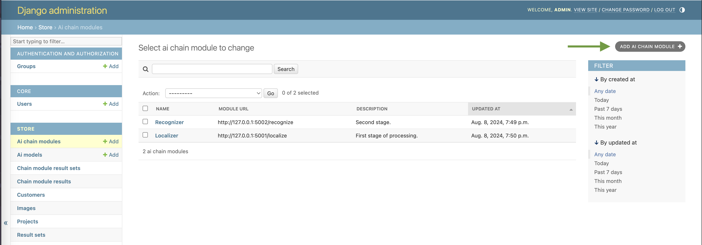
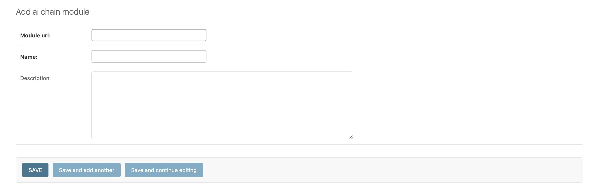

# ba_backend
This is a part of my bachelor thesis on deploying a web application for technical drawing processing. In scope of this project, the [original server](https://github.com/ShipanLiu/ba_server1) was configured to work with the project's [frontend](https://github.com/ghjez/ba_frontend) and extended with microsevice capabilities, allowing for more flexible processing by dynamically chaining multiple local or remote containerized AI-modules.

Credit for creating the original [server](https://github.com/ShipanLiu/ba_server1) goes to [Shipan Liu](https://github.com/ShipanLiu).

**Original README:** https://github.com/ghjez/ba_backend/blob/main/README_ORIGINAL.md  
**Frontend:** https://github.com/ghjez/ba_frontend  
**Additional content** (scripts for AI-modules, etc.)**:** https://github.com/ghjez/ba_supplementary

## Server setup
1. Make sure you have Python 3.10.13 installed.

2. Clone this project to your local machine.

3. **Requirements:** Navigate to the project directory and install the dependencies:
   ```bash
   pip install -r full_requirements.txt
   ```
3. **Setup Database:** Install MySQL on your machine and create a `secrets.py` file in the `project` folder.  
The file structure should look like this: 
   ```
   project
   └ secrets.py
   ```
   Paste the following text into `secrets.py` and edit accordingly:
   ```python
   # secrets.py (add this file to .gitignore)
    DATABASE_NAME = "YOUR_DATABASE_NAME"
    DATABASE_USER = "USER"
    DATABASE_PASSWORD = "USER_PWD"
    DATABASE_HOST = "YOUR_HOST"
    DATABASE_PORT = "3306"  # Default port for MySQL
   ```
4. **Do Initial Migrations** by running the following commands to initialize the database tables:
    ```bash
   python manage.py makemigrations
   python manage.py migrate
   ```
   **In case the migrations do not work**, you can try out these solutinons:
   - Fake the initial migration.
      ```bash
      python manage.py makemigrations 
      python manage.py migrate --fake-initial
      ```
   - Migrate the tables manually one-by-one.
      ```bash
      python manage.py makemigrations {app_label}
      python manage.py migrate {app_label}
      ```
   - Or use the combination of both.
      ```bash
      python manage.py makemigrations {app_label}
      python manage.py migrate --fake-initial {app_label}
      ```

6. **Start the cerver** by running the Django development server:
    ```bash
   python manage.py runserver
   ```
   > This action only starts the main server itself, which is enough for admin panel access and database management, however the processing won't work. Read the "Start the backend" section to properly initialize the backend. 
   
7. **Create a superuser** to access the Django admin panel under   
`localhost:{port}/admin`:
   ```bash
    python manage.py createsuperuser
   ```

5. In case the integrated AI-models are not ___completely___ removed from the project, some parts may still depend on the corresponding database models. As a temporary solution, insert these records to the `ai model` table (the most convenient way to do it is through the admin panel):
   ```
      [
         {
            "id": 1,
            "name": "ai_best",
            "description": "best"
         },
         {
            "id": 2,
            "name": "ai_epoch_299",
            "description": "epoch_299"
         }
      ]
   ```

5. The use of original AI-models was disabled.  
**If you intend to re-enable and use the integrated AI-models**, download the [AI model weights](https://drive.google.com/file/d/1bSP7DinU-4ZfdZFVOZf6zPM8tG7KMvGQ/view?usp=sharing). Unzip `model_weights.zip` and place its contents in the `/store/ai` directory.  
The file structure should look like this: 
   ```
   store
   └ ai
      └ model_weights
         └ weights
            ├ best.pt
            └ epoch_299.pt
         hyp.yaml
         opt.yaml
         README.md
   ```

Start the backend
---
1. **Install Docker**, unless it is already installed, and start it up.
2. This project uses [Celery](https://docs.celeryq.dev/en/stable/getting-started/introduction.html), which requires a message broker. This project uses a containerized Redis instance, however you can also adapt this project to use RabbitMQ or (theoretically) any other message broker.

   To **install a Redis Docker image** run 
   ```bash
   docker pull redis
   ```
3. **Start a redis instance**:
   ```bash
   docker run -p 6379:6379 -d redis
   ```
4. **Start Celery worker** in a separate Terminal (or any other CLI) window:
   ```bash
   celery -A project worker -l info
   ```
5. **Start the cerver** (also in a separate window):
    ```bash
   python manage.py runserver
   ```
6. If starting on a machine that is running MacOS, you can also save some time using the `start_server.sh` shell script that executes the previous three commands. Navigate into the root folder of the project and run:
   ```bash
   sh star_server.sh
   ```

   If your machine runs another operating system, you can create a similar shell script. It is important to start Redis __*before*__ starting the Celery worker.

7. Start the **containerized AI-modules**. This is technically an optional step. However for the processing to produce any results you need at least one module. To find out more, read the "Adding AI-modules" section and visit the [additional content](https://github.com/ghjez/ba_supplementary) repository.

Adding AI-modules
---
> To find out more about containerized AI-modules, visit visit the [additional content](https://github.com/ghjez/ba_supplementary) repository.

> The `AI chain modules` table contains URLs, names and optionally descriptions of the AI-modules. To be able to connect to the AI-module from the server, add a new record with the module's URL to this table (follow the steps below to do it).
1. Start the server:
   ```bash
   python manage.py runserver
   ```
2. Log into the **admin panel**.

3. Open the `Ai chain modules` **table**. 
4. Click the `ADD AI CHAIN MODULE` **button**.

   
5. Add the **module's URL** with the port, it's name and optionally a description.

   
6. Click **Save** below.

AI-modules requirements
---
To work with the current server setup, the AI-modules have to follow the requirements, listed below.
1. Be able to accept a POST request with a file attached.
2. Be able to consume an image or an output file of the previous module in chain.
3. Output a .zip-file with a .json result file. The structure of the .zip-file should resemble this:
   ```
   [further folders]
   └ ...
   results.json # Name can be different
   ```
You can of course, have the modules to process data differently and in different formats, this may however require writing/altering the tasks in the `task.py` file, the models in `models.py` and their respective serializers.

API
---
1. The new **API endpoints** are:  
   Request the available AI-modules:   
   `/store/projects/{project_id}/modules`  
   
   Request the project results:   
   `/store/projects/project_id/chainresults/{optional result set id}`

2. When starting the processing, the body of the POST request must be a string list/array of the modules' URLs in order respective to the modules' places in the processing chain (first URL of the module, meant to be first in the chain etc.).


>  To find out how to configure requests or make them manually (using Postman for example), check out the **User Behaviour Guide** in the [original README](https://github.com/ghjez/ba_backend/blob/main/README_ORIGINAL.md). 